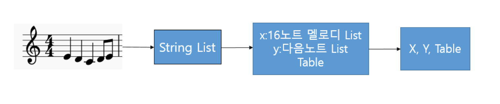
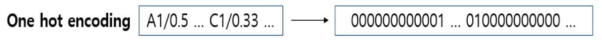
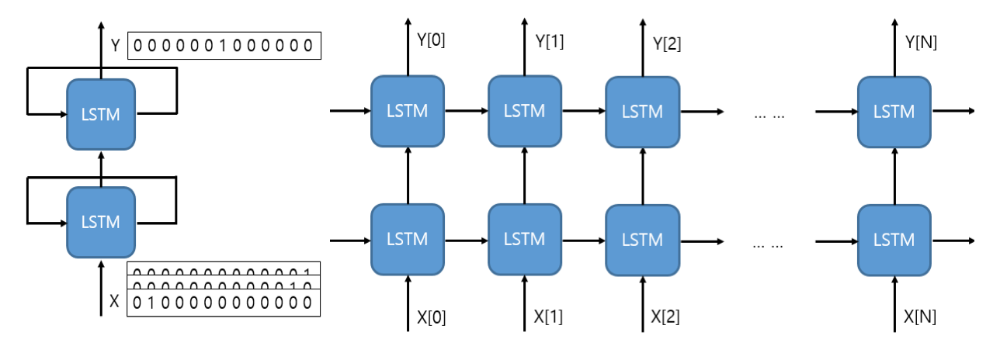
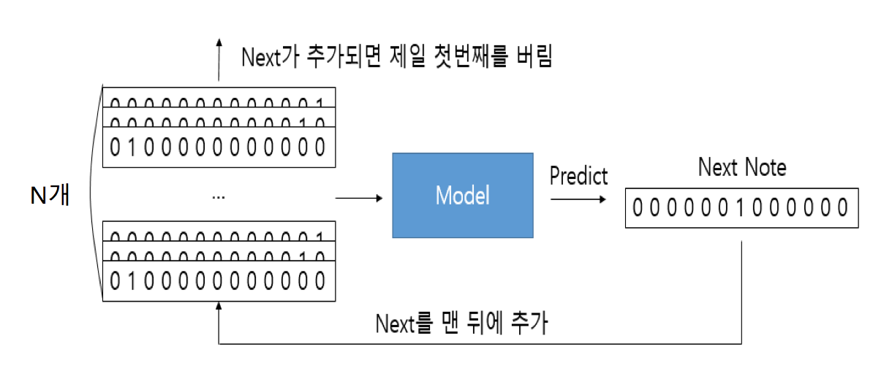
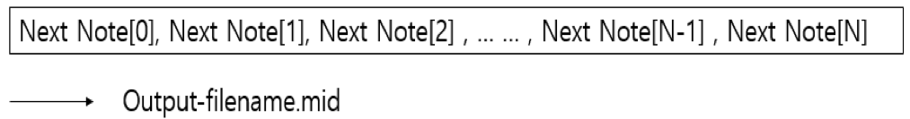

Bard
========
순환신경망(RNN - Recurrent Neural Network)을 이용한 작곡 도우미
midi파일을 입력받아서 비슷한 느낌의 곡의 midi파일을 만들어 줍니다.

## 작동 원리

### 전처리



`.midi` 파일로 들어오는 입력을 String의 리스트로 만들고 다시 x, y, Table로 만들어 줍니다. 이때 x는 n개의 노트로 된 멜로디들의 리스트이고, y는 x의 인덱스에 대응하는 다음 노트의 리스트입니다. Table은 노트가 가질 수 있는 값들을 저장하게 됩니다. x는 전체 멜로디를 n개씩 나눠주는 것이 아닌 한 노트씩 움직여서 n개씩 나누어 주는 방식입니다. 



다음은 x, y에 one hot encoding을 적용하여서 bool형의 리스트로 이루어진 Vector로 바꾸어 줍니다. 이때 각 노트마다 1개의 비트를 차지해야 합니다. 각 비트는 대응하는 weight와 연산이 되어야 하기 때문입니다. ( T1 * w1 + T2 * w2 의 형태) X, Y는 각각의 `.midi`파일들의 x, y의 리스트입니다.

### 학습



학습하기 전에 순환신경망의 모델을 구성해야 합니다. 순환신경망의 개선 형태인 LSTM(Long Short Term Memory)을 사용합니다. LSTM은 기존 순환 신경망의 Weight 상실로 인한 장기기억 문제를 해결한 형태입니다. LSTM은 2개를 사용하였고 연산을 조금이라도 빠르게 하기 위해서 각각 2차원으로 하였습니다. 입력이 2차원이므로 최소로 가능한 차원이 2차원입니다. 차원이 낮더라도 구성한 모델은 전처리 단계에서 만든 X, Y의 리스트들을 학습하게 됩니다. 입출력은 입력이 n개의 멜로디 Vector, 출력이 1개의 note를 나타내는 Vector입니다. Activation 함수는 Gradient Decent의 개선형인 RMSprop을 사용했습니다.

### 생성 
학습한 모델에게 n개의 Note로 되어있는 샘플을 제공하면 다음 Note를 만들게 되고 기존의 샘플에 다음 note를 추가해서 다시 다음 Next Note를 만듭니다.  


  
계속해서 만든 Note들의 리스트를 midi 파일로 만들어 저장합니다.




## 설정

### 주요 사용 패키지
keras, QT5(python3), music21

### linux 설정
```
conda create -n keras python=3 keras qt5
pip install music21
```

### OS X 설정
```
conda create -n keras python=3 qt5
conda install -c conda-forge keras=2.0.2
conda install theano(theano를 backend로 사용한다면)
pip install music21
```

### 실행하기
```
python GUI.py
```


